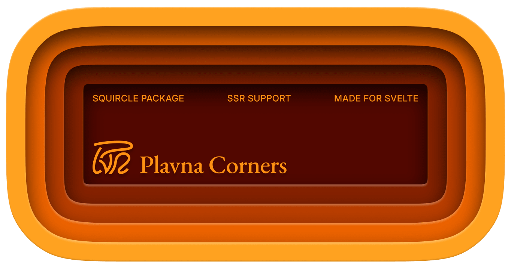

# Plavna Corners

Smooth/squircle/continuous corners for Svelte. Probably the first of its kind to work with SSR. Wrap your block and it will apply a smooth corners mask. Default smoothness is 4.

## Installation

```bash
pnpm install @plavna/corners
```

## Usage

You can also not specify smoothness and it will be set to 4 by default.

```svelte
<script lang="ts">
	import { PlavnaCorners } from '@plavna/corners';
</script>

<PlavnaCorners radius={10} smoothness={4}>
	<div class="quote">Every great leap forward has been driven by a new clarity of thought.</div>
</PlavnaCorners>
```
