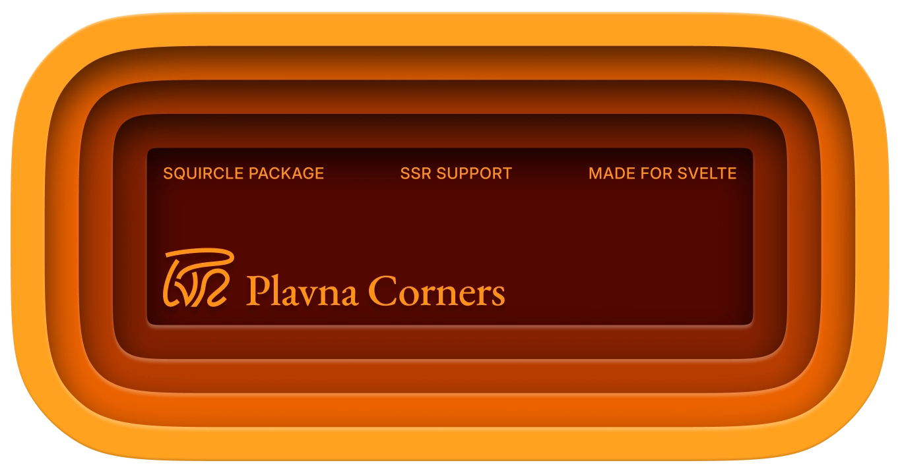

# Plavna Corners



Smooth/squircle/continuous corners for Svelte. Probably the first of its kind to work with SSR. Wrap your block in it and it will apply a smooth corners mask.

```svelte
<script lang="ts">
	import { ContinuousCorners } from '@plavna/corners';
</script>

<ContinuousCorners radius={10} smoothness={10}>
	<div class="quote">Every great leap forward has been driven by a new clarity of thought.</div>
</ContinuousCorners>
```
