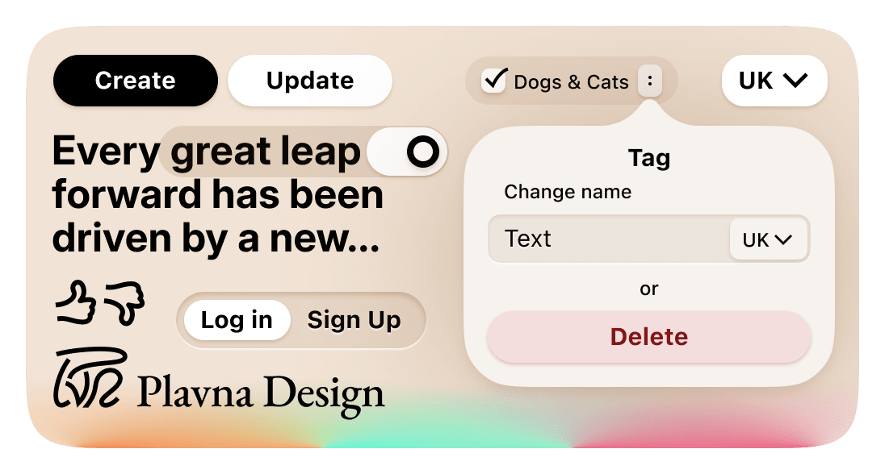

# Plavna Design

Design system that powers [Plavna](https://plvn.app/). Short description is available [here](https://plvn.app/plavna-design/).

## Installation

```bash
pnpm install @plavna/design
```

## Usage

Documentation is to yet to be written, for now you can check components in action by reading [my portfolio on Plavna](https://plvn.app/den) or becoming [an author](https://plvn.app/sign-in/github). You can also see the full list of components and their props in [components folder](./src/lib/components).
